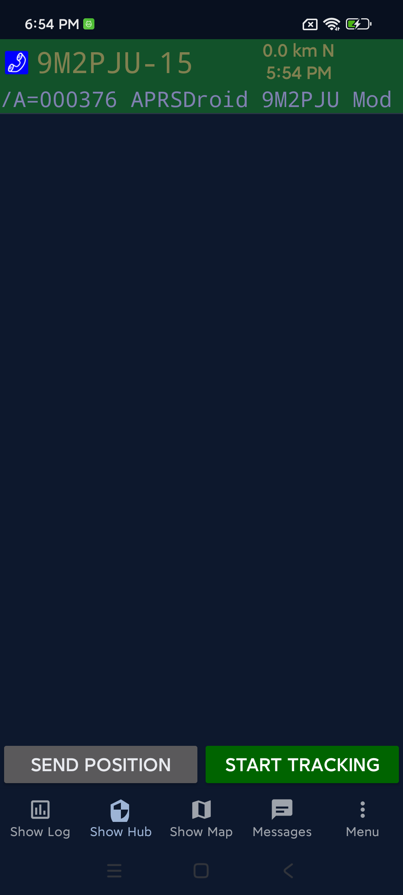
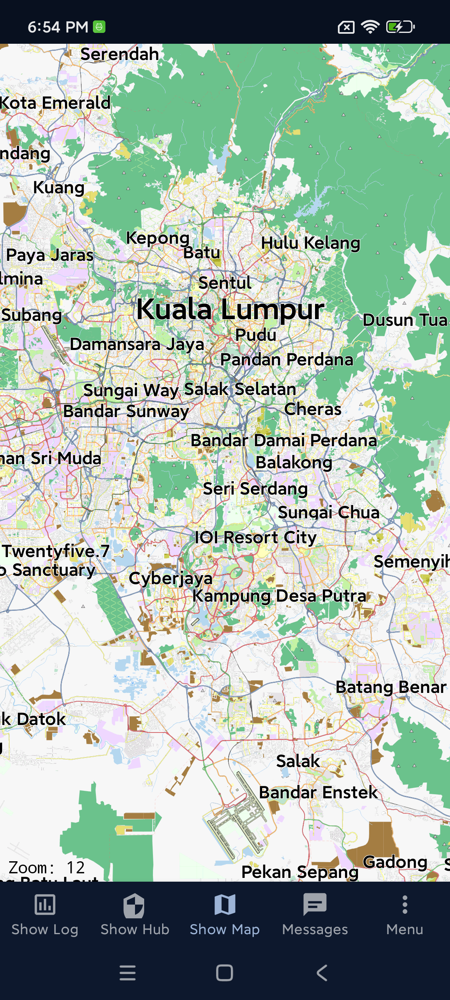
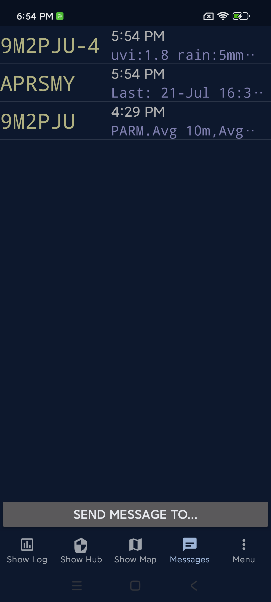
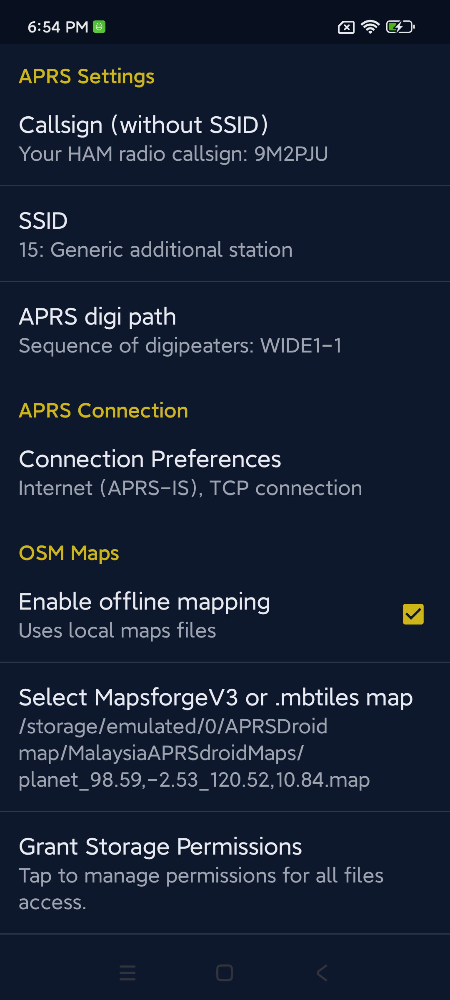
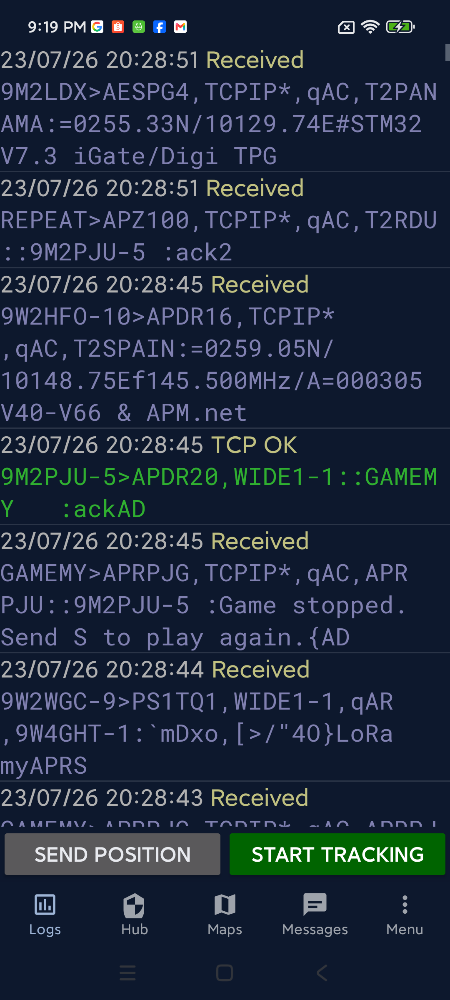

# APRSdroid 9M2PJU Mod
### *Enhanced APRS client for Android*

> **APRSdroid 9M2PJU Mod** is a fork of [NA7Q's enhanced APRSdroid](https://github.com/na7q/aprsdroid),
> which is itself a fork of [Georg Lukas's original APRSdroid](https://aprsdroid.org/).
> It adds modern Android compatibility, a Material Design UI, bottom navigation,
> branded splash screen, in-app updates, GitHub Actions CI/CD with signed release
> builds, and a project landing page at <https://aprsdroid.hamradio.my/>.

---

<div align="center">

[](https://aprsdroid.hamradio.my/)
[](https://www.gnu.org/licenses/gpl-2.0.html)
[](https://www.scala-lang.org/)
[-CEB619?style=for-the-badge)](https://developer.android.com/about/versions/15)
[](https://github.com/9M2PJU/APRSdroid-9M2PJU-Mod/actions/workflows/build.yml)
[](https://github.com/9M2PJU/APRSdroid-9M2PJU-Mod/releases/latest)
[](https://aprsdroid.hamradio.my/)

**[Landing Page](https://aprsdroid.hamradio.my/)** | **[Download](https://github.com/9M2PJU/APRSdroid-9M2PJU-Mod/releases/latest)** | **[Original APRSdroid](https://aprsdroid.org/)** | **[NA7Q Fork](https://github.com/na7q/aprsdroid)** | **[Source](https://github.com/9M2PJU/APRSdroid-9M2PJU-Mod)**

</div>

---

## About

**APRSdroid 9M2PJU Mod** is an Android client for the
[APRS (Automatic Packet Reporting System)](http://aprs.org/) network.
It is a fork of [NA7Q's enhanced APRSdroid](https://github.com/na7q/aprsdroid),
which is itself a fork of [Georg Lukas's original APRSdroid](https://aprsdroid.org/).

### The APRSdroid family tree

| Project | Author | Description |
|---|---|---|
| [APRSdroid](https://aprsdroid.org/) | Georg Lukas (ge0rg) | The original APRS client for Android, since 2010. Scala + Java, GPLv2. |
| [NA7Q's fork](https://github.com/na7q/aprsdroid) | NA7Q | Enhanced fork with BLE TNC, digipeater, IGate, Mic-E, offline maps. [Homepage](https://na7q.com/aprsdroid-osm/) |
| **APRSdroid 9M2PJU Mod** (this repo) | 9M2PJU | Builds on NA7Q's fork with modern Android, Material UI, CI/CD, in-app updates. |

This mod is maintained by **9M2PJU** (Kuala Lumpur, Malaysia) and focuses on
modern Android compatibility, UI/UX polish, and project infrastructure.
The direct upstream is [NA7Q's fork](https://github.com/na7q/aprsdroid).

### What 9M2PJU added on top of NA7Q's fork

- **Adaptive launcher icon** for Android 13+ -- full logo with navy
  background, no default border (matches WhatsApp-style icons)
- **Modern Android support** -- `targetSdk 35` (Android 15), foreground service
  types for Android 14+, Bluetooth permissions for Android 12+, storage
  permissions for Android 11+, `POST_NOTIFICATIONS` for Android 13+,
  edge-to-edge opt-out for Android 15+ with proper system bar inset handling
  (status bar, navigation bar, display cutout)
- **Material Design dark theme** -- `Theme.MaterialComponents` with navy/amber
  palette, bottom navigation bar, modern component styles
- **Branded full-screen splash screen** -- centerCrop rendering with hidden
  navigation bar on Android 16 for a true immersive splash
- **In-app update checker** -- download and install updates directly from
  GitHub Releases, with Cloudflare CDN fallback when GitHub API is unreachable
- **GitHub Actions CI/CD** -- signed release APK builds, automatic GitHub
  Releases on `v*` tags, auto-generated `version.json` for the update checker
- **GitHub Pages landing page** at <https://aprsdroid.hamradio.my/> with
  live download counters, responsive design for desktop and mobile browsers
- **New app icon and logo** across all density buckets
- **Map auto-zooms to GPS location** -- on first open, the map centers on
  the user's last known GPS position instead of a hardcoded default
- **Map recenter button repositioned** -- sits above the OSM zoom controls
  to avoid overlap
- **Restored OSM Maps preferences** -- file picker first, then offline
  mapping toggle (with guidance to select a map file before enabling),
  MapsForge / MBTiles file picker, storage permissions button, hardware
  acceleration toggle
- **About dialog with logo and full credits** -- app logo, project lineage,
  and credits to Bob Bruninga (WB4APR), Georg Lukas (DO1GL), NA7Q, and 9M2PJU
- **Bottom navigation with Menu tab** -- quick access to Preferences, Hub,
  Log, Map, Messages, and more from any screen, with no sliding animation
  between tabs
- **Android 14+ crash fix** -- `RECEIVER_NOT_EXPORTED` flag for
  `registerReceiver` (required by Android 14/Upside Down Cake)
- **APRS messaging bots &amp; services** -- one-tap access to 9 APRS-based
  services: Winlink (WLNK-1), WTSAPP, 9M2PJU-4 BOT, APRSMY Net, MAILMY,
  REPEATER, CALLMY, BBSMY, and GAMEMY -- each with quick-action buttons
  that send correctly formatted APRS commands. See the
  [APRS Messaging Bots &amp; Services](#aprs-messaging-bots--services)
  section below for full details.
- **Winlink APRSLink integration** -- full email gateway with automatic
  password challenge/response, session management, auto-login, login
  timeout recovery, and multi-line email composition
- **Android 16 navigation bar fixes** -- dark nav bar on splash and map
  screens, full-screen splash with hidden nav bar using
  `WindowInsetsController`
- **Conversations grid layout** -- 3x3 grid of service buttons with a
  full-width "Send message to..." button on top
- **SQLite timestamp fix** -- replaced unsupported `strftime('%y')` with
  `substr()` for proper DD/MM/YY formatting on Android's SQLite
- **Bottom nav highlighting fix** -- correct tab highlighting with
  `FLAG_ACTIVITY_REORDER_TO_FRONT` across all activities
- **App name and About dialog unified** across all 52 locale files
- **Version bumped** to `v2.0.13` (tocall `APDR20`)

> **Changelog:** Per-version release notes are now maintained on the
> [GitHub Releases](https://github.com/9M2PJU/APRSdroid-9M2PJU-Mod/releases)
> page rather than duplicated here.

### Features inherited from NA7Q's fork

- **Digipeater** -- direct or full digipeating
- **2-Way IGating** -- full Internet Gateway functionality
- **BLE TNC support** -- Mobilinkd, DigiRig, and other Bluetooth TNCs
- **Offline maps** -- MBTiles + MapsForge V3 with OpenStreetMap
- **Radio control** -- Vero, BTech, Radioddity, and other radios
- **Mic-E compression** -- efficient position encoding with emergency status
- **Symbol overlay support**
- **Unit options** -- metric or imperial

### Features from the original APRSdroid

- **Real-time position reporting** via GPS
- **APRS messaging** -- send and receive messages
- **TCP/IP connectivity** to APRS-IS
- **AFSK modem** for audio-based TNC
- **USB TNC support**

---

## APRS Messaging Bots &amp; Services

The **Messages** screen provides one-tap access to a growing suite of
APRS-based bots and gateway services. Each service is a remote callsign
you can converse with using quick-action buttons -- no need to memorize
commands. Just open a conversation, tap a button, and the app sends the
correctly formatted APRS message for you.

### Conversations screen layout

```
+-----------------------------------------+
|          Send message to...             |  ← start a new conversation
+-----------+-----------+-----------+
|  Winlink  |  WTSAPP   |9M2PJU-4..|  ← row 1
+-----------+-----------+-----------+
| APRSMY Net|  MAILMY   | REPEATER  |  ← row 2
+-----------+-----------+-----------+
|  CALLMY   |  BBSMY    |  GAMEMY   |  ← row 3
+-----------+-----------+-----------+
```

### Service reference

| Service | Callsign | Type | Buttons | Description |
|---|---|---|---|---|
| **Winlink** | `WLNK-1` | Stateful | 9 | Send/receive Winlink email via APRSLink. Login with password challenge, list/read/reply/forward/kill messages, compose multi-line emails. |
| **WTSAPP** | `WTSAPP` | Stateless | 3 | WhatsApp gateway -- send WhatsApp messages via APRS. Manage aliases, compose messages, remove aliases. |
| **9M2PJU-4 BOT** | `9M2PJU-4` | Stateless | 13 | Multi-function APRS bot: weather (Today), position messaging (PosMsg), location lookup (WhereIs, WhereAmI), satellite info (RiseSet, SatPass), SOTA/POTA spots &amp; alerts, nearby Police/Hospital/Fire stations, HF propagation forecast (Prop), and Help. |
| **APRSMY Net** | `APRSMY` | Stateless | 7 | Malaysian APRS network service. Check in, get net info, list check-ins, and more. |
| **MAILMY** | `MAILMY` | Stateless | 6 | Lightweight email gateway. Send email with optional position, check delivery status, cancel pending sends. |
| **REPEATER** | `REPEAT` | Stateless | 2 | Find nearby amateur radio repeaters. Specify number, band (2m/70cm/6m/10m/1.25m/33cm/23cm), and optional capability filters (echolink, dstar, ares, etc.). |
| **CALLMY** | `CALLMY` | Stateless | 2 | Check Malaysian amateur radio callsign info and license expiry. Enter any Malaysian callsign to get registration and expiry details. |
| **BBSMY** | `BBSMY` | Stateless | 6 | APRS BBS (bulletin board system). List messages, read by number, post public bulletins, send private messages, post urgent notices. |
| **GAMEMY** | `GAMEMY` | Stateless | 7 | APRS trivia game. Start a game, get hints, skip questions, check your score, view the leaderboard, and stop the game. |

### Winlink (WLNK-1) -- APRSLink email gateway

Winlink integration uses the [APRSLink](https://winlink.org/APRSLink)
protocol to send and receive Winlink email via APRS messages addressed
to `WLNK-1`. The app handles the full login handshake automatically:

1. **Login** -- sends a command to WLNK-1, receives a password challenge,
   computes the response from your Winlink password, and sends it back.
2. Once logged in, you can **List** pending messages, **Read** by number,
   **Reply**, **Compose** new emails (multi-line, auto-split into 67-char
   APRS messages), **Forward** to another address, and **Kill** (delete)
   messages.
3. **Logout** sends the `B` command to end the session.

> **Setup:** Set your callsign and Winlink password in
> **Preferences → Messaging** before using Winlink. Enable **Auto-login**
> to automatically log in when the APRS service starts.

### 9M2PJU-4 BOT -- Multi-function APRS bot

The 9M2PJU-4 BOT is a multi-purpose APRS information service operated by
9M2PJU. It provides 13 quick-access commands:

| Button | Command | Function |
|---|---|---|
| Help | `help` | List available commands |
| Today | `today` | Today's weather summary |
| PosMsg | `posmsg` | Send position message to email |
| WhereIs | `whereis` | Look up a location |
| WhereAmI | `whereami` | Report your current location |
| RiseSet | `riseset` | Sunrise/sunset times |
| SatPass | `satpass` | Satellite pass predictions |
| SOTA | `sota spots` / `sota alerts` | SOTA (Summits on the Air) spots or alerts |
| POTA | `pota spots` / `pota alerts` | POTA (Parks on the Air) spots or alerts |
| Police | `police` | Nearby police stations |
| Hospital | `hospital` | Nearby hospitals |
| Fire Stn | `fire` | Nearby fire stations |
| Prop | `prop` | HF propagation forecast |

### REPEATER (REPEAT) -- Repeater lookup

Find nearby amateur radio repeaters using the REPEAT protocol. The
**Nearest** dialog lets you specify:

- **Number** -- how many repeaters to return (1-10, default 1)
- **Band** -- 2m, 70cm, 6m, 10m, 1.25m, 33cm, or 23cm (default 2m)
- **Filters** -- optional capability filters like `+echolink`, `+dstar`,
  `+ares`, `+fusion`, `+dmr`, etc.

The app sends the command `n [Num] [Band] [+Filter]` to `REPEAT` and
displays the response in the conversation.

---

## Screenshots

<div align="center">

| Splash | Log | Hub |
|:---:|:---:|:---:|
|  |  |  |

| Map | Messages | Menu |
|:---:|:---:|:---:|
|  |  |  |

| Preferences | About | Connection Prefs |
|:---:|:---:|:---:|
|  |  |  |

| Digipeater Prefs | I-Gate Prefs | Messaging Prefs |
|:---:|:---:|:---:|
|  |  |  |

| Winlink Prefs | Location Prefs | Compressed Prefs |
|:---:|:---:|:---:|
|  |  |  |

| APRS Symbol | Privacy Prefs | Notification Prefs |
|:---:|:---:|:---:|
|  |  |  |

</div>

---

## Quick Start

### Installation

> **Important:** Uninstall any previous official version of APRSdroid before
> installing this mod -- the signing key differs, so Android will refuse an
> in-place upgrade.

1. Download the latest signed release APK from the
   [Releases page](https://github.com/9M2PJU/APRSdroid-9M2PJU-Mod/releases/latest)
   (or browse all releases on the
   [landing page](https://aprsdroid.hamradio.my/))
2. Install the APK on your Android device (enable "Install from unknown
   sources" if prompted)
3. On Android 11+, grant *All files access* for offline MBTiles maps

### Maps

The default map is **OpenStreetMap (online)** and auto-zooms to your
GPS location on first open. To use offline maps:

1. Go to **Menu** (bottom nav) → **Preferences** → **OSM Maps**
2. Tap **"Select MapsforgeV3 or .mbtiles map"** and choose your `.map`
   or `.mbtiles` file
3. Enable **"Enable offline mapping"**
4. (Optional) Tap **"Grant Storage Permissions"** if the file can't be
   read
5. (Optional) Toggle **"Enable Hardware Acceleration"** for smoother
   map rendering (on by default)
6. Open **Map** -- offline tiles will load without internet

#### Malaysia, Singapore & Brunei offline map

A ready-to-use offline map for Malaysia, Singapore, and Brunei is
available as a GitHub release asset:

> [**Download Malaysia Offline Maps**](https://github.com/9M2PJU/APRSdroid-9M2PJU-Mod/releases/tag/maps-v1.0)
> (528 MB zip, contains MapsForge `.map` + MBTiles files)

**Installation:**
1. Download and extract the zip file on your computer
2. Copy `malaysia-singapore-brunei.map` to your phone (any folder)
3. In APRSdroid: **Menu** → **Preferences** → **OSM Maps** → **Select MapsforgeV3 or .mbtiles map**
4. Select the `.map` file you copied
5. Enable **"Enable offline mapping"**
6. Open **Map** -- the offline map loads without internet

#### Other map sources

NA7Q provides several tools for downloading offline maps for other regions:

| Tool | Platform | Description |
|---|---|---|
| [World Map](https://na7q.com/wp-content/uploads/2024/12/map.mbtiles) | Any | Ready-to-use starter world map (zoom 6) |
| [OSM Map Maker](https://downloads.aprs.wiki/APRSdroid/gui7-concurrency.exe) | Windows | GUI tool for downloading OSM maps |
| [Python Map Maker](https://na7q.com/wp-content/uploads/2025/01/gui7-concurrency.py) | Cross-platform | Python script version |
| [Multi-Map Maker](https://na7q.com/wp-content/uploads/2025/02/mapmaker-0.2.exe) | Windows | Google, OSM, USGS, Canada Topo, and more |
| [Map Viewer](https://na7q.com/wp-content/uploads/2025/02/mapviewer.exe) | Windows | Preview different map styles |
| [BBBike MapsForge](https://extract.bbbike.org/) | Web | Custom MapsForge OSM maps online |

### Connecting a LoRa APRS Tracker via Bluetooth (BLE KISS TNC)

APRSdroid can connect to LoRa APRS tracker boards (e.g. LilyGO T-Beam,
TTGO T-Beam, Heltec WiFi LoRa 32, RAK Wireless modules, and other
ESP32-based APRS trackers) using **Bluetooth Low Energy (BLE)** with
the **KISS TNC** protocol. This lets you send and receive APRS packets
over LoRa radio without a phone data connection.

#### Requirements

- A LoRa APRS tracker board with BLE KISS TNC firmware (e.g.
  [richonguzman's LoRa APRS Tracker](https://github.com/richonguzman/LoRa_APRS_Tracker))
- Android phone with Bluetooth
- APRSdroid 9M2PJU Mod installed

#### Setup steps

1. **Flash your tracker board** with BLE KISS TNC firmware (if not
   already done). The firmware must advertise a BLE KISS service.
2. **Power on the tracker** and put it in BLE pairing mode (usually
   automatic on boot).
3. **Pair the tracker with your phone:**
   - Go to Android **Settings** → **Bluetooth**
   - Find your tracker in the device list (e.g. "LoraTracker" or
     "LoRa_APRS")
   - Tap to pair
4. **Configure APRSdroid:**
   - Open APRSdroid → **Menu** → **Preferences** → **Connection Setup**
   - Select **Bluetooth TNC (KISS)** as the backend
   - Select your tracker from the Bluetooth device list
   - Set your callsign and passcode
5. **Start the service:**
   - Tap the **Start** button (or **Menu** → **Start**)
   - APRSdroid will connect to the tracker via BLE
   - Position reports are sent over LoRa radio
   - Received packets appear in the Log and on the Map

#### How it works

```
GPS → Phone → APRSdroid → BLE → LoRa Tracker → LoRa Radio → APRS Network
                                                    ↓
                                          Received packets → APRSdroid
```

- **Outgoing:** APRSdroid gets your GPS position, formats an APRS
  packet, and sends it to the tracker via BLE KISS TNC. The tracker
  transmits it over LoRa radio.
- **Incoming:** The tracker receives LoRa APRS packets and forwards
  them to APRSdroid via BLE. APRSdroid decodes and displays them.

---

## Documentation & Support

- [Landing Page](https://aprsdroid.hamradio.my/)
- [Releases & download counters](https://aprsdroid.hamradio.my/#download)
- [Original APRSdroid FAQ](https://github.com/ge0rg/aprsdroid/wiki/Frequently-Asked-Questions)
- [Original APRSdroid Configuration Guide](https://github.com/ge0rg/aprsdroid/wiki/Settings)
- [NA7Q's Homepage](https://na7q.com/aprsdroid-osm/) & [Changelog](https://na7q.com/aprsdroid-changelog/)

---

## License

This project is licensed under the **GNU General Public License v2.0** -- see
the [LICENSE](LICENSE) file for details.

---

## Contributing

Contributions are welcome from the amateur radio community! Please open an
issue or pull request at the
[APRSdroid-9M2PJU-Mod repo](https://github.com/9M2PJU/APRSdroid-9M2PJU-Mod).

---

## Credits

### Georg Lukas (ge0rg) -- Original Author

[APRSdroid](https://aprsdroid.org/) was created by **Georg Lukas, ge0rg** and
has been the premier APRS client for Android since 2010. Written in Scala
with a Java core, it supports TCP/IP, AFSK, Bluetooth TNCs, and USB TNCs.
Georg continues to maintain the upstream project and licenses it under the
GPLv2 so that the community can build on his work.

### NA7Q -- Enhanced Fork

[NA7Q's fork](https://github.com/na7q/aprsdroid) builds on Georg's original
work with BLE TNC support, digipeater and IGate functionality, symbol
overlays, Mic-E improvements, and offline mapping. NA7Q's fork is the direct
upstream of this mod. Homepage: <https://na7q.com/aprsdroid-osm/>

### 9M2PJU -- This Mod

This mod is maintained by **9M2PJU** (Kuala Lumpur, Malaysia). It builds on
NA7Q's fork with modern Android compatibility, Material Design UI, bottom
navigation, in-app updates, CI/CD, and a landing page.

### Bob Bruninga, WB4APR -- Creator of APRS

**Bob Bruninga, WB4APR** (1947-2022) created the Automatic Packet Reporting
System (APRS) in the 1980s. His vision of a real-time, position-aware digital
communications network for amateur radio lives on in every APRS client,
igate, and digipeater worldwide. Without Bob's pioneering work, none of this
would exist.

APRS® is a registered trademark of Bob Bruninga, WB4APR.

---

## Support the project

If you find APRSdroid 9M2PJU Mod useful, consider supporting development:

| Method | Link |
|---|---|
| Malaysia e-wallet (scan QR) | See QR below |
| Buy Me a Coffee | https://www.buymeacoffee.com/9m2pju |
| Wise (tag: faizulz13) | https://wise.com/pay/me/faizulz13 |

<div align="center">


*Scan with Boost, Touch 'n Go, GrabPay, or any Malaysian e-wallet*

</div>

---

<div align="center">

**Made with care by [9M2PJU](https://hamradio.my). 73.**

</div>
